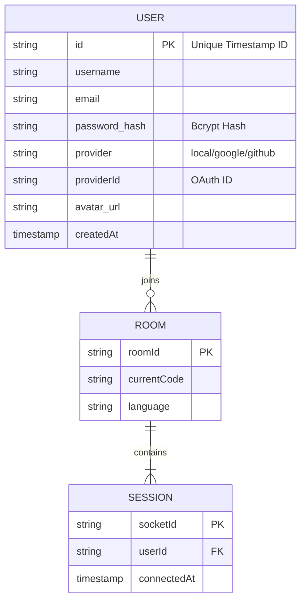

# 🧩 MeowCollab – Real-Time Collaborative Code Editor


## 🚀 Overview

**MeowCollab** is a powerful, full-stack web application designed for seamless real-time code collaboration. It empowers developers, students, and interviewers to write, execute, and debug code together in a shared virtual environment.

With support for **16 programming languages**, secure authentication, and instant code synchronization, MeowCollab bridges the gap between remote team members, making pair programming and technical interviews efficient and interactive.

---

## 🌟 Key Features

### 🧠 Real-Time Collaboration
*   **Live Editing:** See changes as they happen. Multiple users can type in the same file simultaneously without conflicts.
*   **Instant Synchronization:** Powered by **Socket.IO**, ensuring low-latency updates across all connected clients.
*   **Presence Indicators:** See who is currently active in the room with a dynamic user list.

### 💻 Powerful Code Execution
*   **Multi-Language Support:** Write and run code in **16 languages** including Python, Java, C++, JavaScript (Node.js), Go, Rust, and more.
*   **Secure Sandbox:** Code is executed securely via the **JDoodle API**, isolating user code from the server infrastructure.
*   **Live Output:** View compilation results, standard output, and error logs instantly in the integrated terminal.

### 🔐 Authentication & Security
*   **Flexible Login:** Choose your preferred method:
    *   **Guest Access:** Quick entry for instant collaboration without sign-up.
    *   **Social Login:** One-click sign-in with **Google** or **GitHub**.
    *   **Email/Password:** Traditional secure account creation.
*   **Session Management:** Persistent sessions using `express-session` and secure cookies.
*   **Password Hashing:** User passwords are encrypted using `bcrypt` for maximum security.

### 🎨 Modern Developer Experience
*   **Sleek UI:** Built with **React** and **Bootstrap**, featuring a dark-themed interface optimized for long coding sessions.
*   **Syntax Highlighting:** Integrated **CodeMirror** editor with the Dracula theme for excellent code readability.
*   **Room Management:** Generate unique room IDs to create private coding spaces.

---

## 🏗️ Architecture & Tech Stack

MeowCollab follows a modern **MERN-style** architecture (MongoDB, Express, React, Node.js), utilizing WebSockets for real-time communication.

### 🔧 Tech Stack

| Category | Technology | Purpose |
|----------|------------|---------|
| **Frontend** | React.js | Component-based UI library |
| | Bootstrap 5 | Responsive styling and layout |
| | CodeMirror | Advanced code editor component |
| | Socket.IO Client | Real-time bidirectional communication |
| | Axios | HTTP client for API requests |
| **Backend** | Node.js | Runtime environment |
| | Express.js | Web framework for API and routing |
| | Socket.IO | WebSocket server for collaboration events |
| | Passport.js | Authentication middleware (Local, Google, GitHub) |
| **Execution** | JDoodle API | Remote code execution engine |
| **Data** | JSON / In-Memory | Lightweight data storage (scalable to MongoDB) |

### 📊 System Architecture (ER Diagram)

Below is the data model representing the entities stored in the system.

> [!NOTE]
> **Data Persistence:** User data is stored in a JSON file (`users.json`) on the server. To ensure data integrity during concurrent writes (e.g., multiple users signing up simultaneously), a **Mutex (Locking Mechanism)** is implemented in the backend.



---

## 📂 Project Structure

```bash
MeowCollab/
├── client/                 # Frontend React Application
│   ├── public/            # Static assets
│   ├── src/
│   │   ├── components/    # Reusable UI components (Editor, Navbar, etc.)
│   │   ├── pages/         # Main application pages
│   │   ├── App.js         # Main component & Routing
│   │   └── socket.js      # Socket.IO client instance
│   └── package.json       # Client dependencies
│
├── server/                 # Backend Node.js Application
│   ├── auth.js            # Passport authentication strategies
│   ├── index.js           # Express server & Socket.IO setup
│   ├── Actions.js         # WebSocket event constants
│   ├── users.json         # File-based user storage
│   └── package.json       # Server dependencies
│
└── README.md              # Project documentation
```

---

## 📝 Supported Languages

1.  **Python 3**
2.  **Java**
3.  **C++**
4.  **C**
5.  **Node.js (JavaScript)**
6.  **Ruby**
7.  **Go**
8.  **Scala**
9.  **Bash**
10. **SQL**
11. **Pascal**
12. **C#**
13. **PHP**
14. **Swift**
15. **Rust**
16. **R**

---

## � Getting Started

### Prerequisites
*   **Node.js** (v14 or higher)
*   **npm** (Node Package Manager)
*   **JDoodle API Credentials** (for code execution)

### Installation

1.  **Clone the repository:**
    ```bash
    git clone https://github.com/AyushCodes160/Test_Sub.git
    cd Test_Sub
    ```

2.  **Install Server Dependencies:**
    ```bash
    cd server
    npm install
    ```

3.  **Install Client Dependencies:**
    ```bash
    cd ../client
    npm install
    ```

4.  **Environment Configuration:**

    Create a `.env` file in the `server` directory:
    ```env
    PORT=5001
    jDoodle_clientId=YOUR_JDOODLE_CLIENT_ID
    kDoodle_clientSecret=YOUR_JDOODLE_CLIENT_SECRET
    SESSION_SECRET=your_super_secret_session_key
    # Optional: For Google/GitHub Auth
    GOOGLE_CLIENT_ID=...
    GOOGLE_CLIENT_SECRET=...
    GITHUB_CLIENT_ID=...
    GITHUB_CLIENT_SECRET=...
    ```

5.  **Start the Application:**

    **Backend:**
    ```bash
    cd server
    npm start
    ```

    **Frontend:**
    ```bash
    cd client
    npm start
    ```

6.  **Access the App:**
    Open your browser and navigate to `http://localhost:3000`.

---

## 🤝 Contributing

Contributions are welcome! Please fork the repository and submit a pull request for any enhancements or bug fixes.

## � License

This project is licensed under the **ISC License**.
